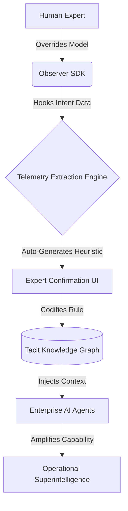

# Cognitive.OS (Project Vision)

**The Future of AI is not General. It is Specialised and Adaptive.**

## Executive Summary
Every organisation runs on two operating systems:
1. **The Official OS:** SOPs, dashboards, and documented processes.
2. **The Real OS:** The cognitive intuition and overrides that your senior experts actually use.

The real OS has never been captured. When senior experts leave, their heuristics—built over tens of thousands of hours—walk out the door. We are building the infrastructure to make this invisible intelligence visible, durable, and computable.

## The Cognitive Architecture

We are building a 3-Layer System to capture tacit knowledge:

### Layer 1: The Observer SDK
A non-disruptive telemetry engine running quietly in the background of enterprise tools. It does not measure clicks; it measures *intent*. It detects hesitation anomalies and model overrides (e.g., when a senior underwriter ignores the AI prediction and manually adjusts variables).

### Layer 2: The Telemetry Extraction Engine
Once an override is detected, the engine isolates the decision context. It surfaces heuristic candidates to the expert in real-time ("Did you override because variable X in historical dataset Y was anomalous?"). The expert validates this instantly.

### Layer 3: The Tacit Knowledge Graph
The validated heuristics are codified into a highly structured Knowledge Graph. Instead of generic LLM priors, the next generation of company AI models queries this graph to replicate proven human judgment.

## Architecture Diagram

## The Final Output
A God-Tier Enterprise SaaS platform. This codebase will serve as the demonstration shell, implementing strict Software Factory patterns to showcase to stakeholders how deep architectures are built.
